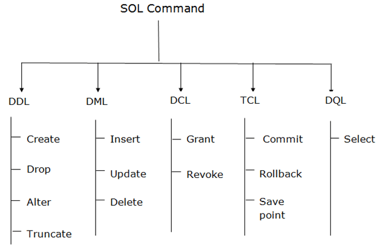

**SQL NOTES**
**References:**
- [Tutorials Point](https://www.tutorialspoint.com/sql/index.htm)
- [w3schools](https://www.w3schools.com/sql/sql_intro.asp)
---
**Definition:**
- SQL stands for structured query language
- It is a query language used to manage data in relational database such as ms sql server,oracle, ibm db2, mysql, microsoft access.
- The data in RDBMS is stored in database objects called tables. A table is a collection of related data entries and it consists of columns and rows.

---
**RDBMS Concepts:**
[RDBMS Concepts](https://www.tutorialspoint.com/sql/sql-rdbms-concepts.htm)
- Definition
- Table
- Field
- Record or Row
- Column
- Null Value
- Constraints:
    - NOT NULL
    - DEFAULT
    - UNIQUE KEY
    - PRIMARY KEY
    - FOREIGN KEY
    - CHECK
    - INDEX
- Data Integrity
    - Entity Integrity
    - Domain Integrity
    - Referential Integrity
    - User-Defined Integrity
- Database Normalization
---
**SQL Basic Commands:**

